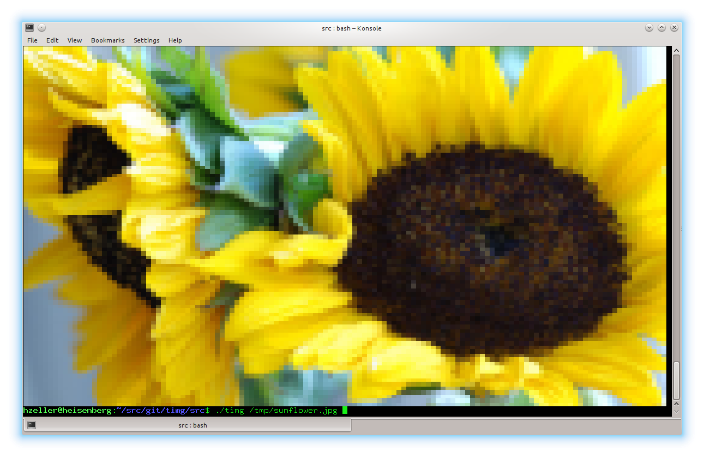

timg - Terminal Image Viewer
============================

An image viewer that uses the 24-Bit color capabilities and character blocks
as pixels to display images in a terminal.



Displays regular images, shows animated gifs or allows to scroll static images.

Very useful for if you want to have a quick visual check without starting a
bulky image viewer ... and don't care about resolution.

### Install

```bash
sudo apt-get install libgraphicsmagick++-dev     # required library.
cd src
make
sudo make install
```

###Synopsis

```
usage: timg [options] <image>
Options:
        -g<w>x<h>  : Output pixel geometry. Default from terminal 132x88
        -s[<ms>]   : Scroll horizontally (optionally: delay ms (60)).
        -t<timeout>: Animation or scrolling: only display for this number of seconds.
```

###Examples
```
timg some-image.jpg         # display a static image

timg some-animated.gif      # show an animated gif (stop with Ctrl-C)
timg -t5 some-animated.gif  # show animated gif for 5 seconds

timg -s some-image.jpg      # scroll a static image as banner (stop with Ctrl-C)

# Also, you could store the output and cat later to your terminal...
timg some-image.jpg > /tmp/imageout.txt
cat /tmp/imageout.txt

```

Note, this requires that your terminal can display 24 bit colors and is able
to display the character ▀ (U+2580, 'Upper Half Block'). If not, it doesn't
show anything or it is garbage.

Tested terminals: `konsole` and `gnome-terminal` look good, recent xterms
also seem to work (albeit with less color richness). Linux console seems to
be limited in colors and the block character.

